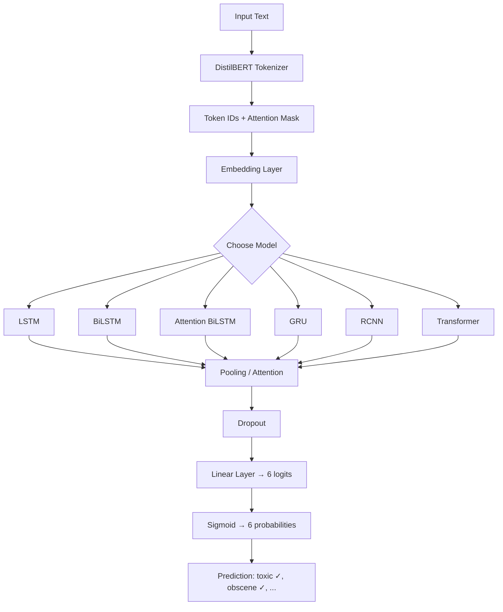
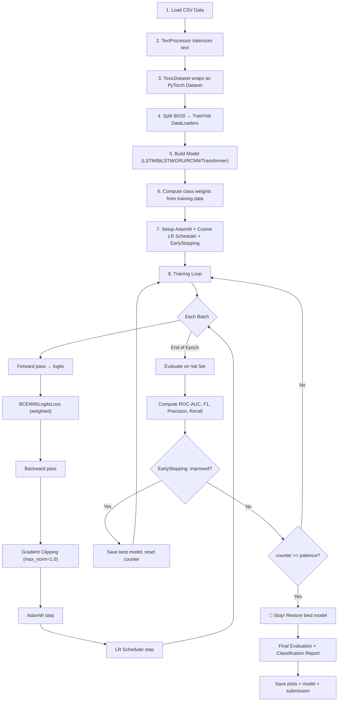

# 🧠 Toxic Comment Classification — Complete Project Explanation

## Table of Contents
1. [Project Overview](#1-project-overview)
2. [Architecture Overview](#2-architecture-overview)
3. [Existing Code Explanation](#3-existing-code-explanation)
4. [New Optimizations Added](#4-new-optimizations-added)
5. [File-by-File Breakdown](#5-file-by-file-breakdown)
6. [How It All Works Together](#6-how-it-all-works-together)
7. [Tips for the Exam](#7-tips-for-the-exam)

---

## 1. Project Overview

> **Task**: Multi-label text classification on the [Jigsaw Toxic Comment Classification Challenge](https://www.kaggle.com/competitions/jigsaw-toxic-comment-classification-challenge/overview)

Each comment can be labeled with **one or more** of 6 categories:
| Label | Example |
|-------|---------|
| `toxic` | "You are an idiot" |
| `severe_toxic` | Extremely offensive content |
| `obscene` | Profanity |
| `threat` | "I'll find where you live" |
| `insult` | Personal attacks |
| `identity_hate` | Hate based on identity |

> [!IMPORTANT]
> This is **multi-label** (not multi-class): a comment can be both `toxic` AND `obscene` at the same time. That's why we use `BCEWithLogitsLoss` (Binary Cross-Entropy) instead of `CrossEntropyLoss`.

### Project Structure
```
y4t2_intro_deep_learning_project/
├── datasets/
│   ├── train.csv           # Training data (~160k comments)
│   ├── test.csv            # Test data for submission
│   ├── test_labels.csv     # Ground truth for test set
│   └── sample_submission.csv
├── src/
│   ├── constant.py         # All hyperparameters and paths
│   ├── main.py             # Training + evaluation pipeline
│   ├── preprocessing/
│   │   └── preprocessing.py  # Text tokenization using DistilBERT tokenizer
│   ├── custom_dataset/
│   │   └── toxic_dataset.py  # PyTorch Dataset class
│   ├── models/
│   │   ├── lstm/           # LSTM, BiLSTM, Attention LSTM, Attention BiLSTM
│   │   ├── gru/            # GRU (from scratch)
│   │   ├── rcnn/           # Recurrent CNN
│   │   └── transformer/    # Custom Transformer Encoder
│   └── utils/              # 🆕 NEW: Metrics, Early Stopping, LR Scheduler
│       ├── metrics.py
│       ├── early_stopping.py
│       └── lr_scheduler.py
├── models/                 # Saved model weights (.pth files)
└── plots/                  # Training visualization plots
```

---

## 2. Architecture Overview

### What makes this project "from scratch"?
You implemented the core building blocks (cells, gates, attention) manually using `nn.Parameter` and matrix operations, rather than using PyTorch's built-in `nn.LSTM`, `nn.GRU`, etc. This demonstrates deep understanding of how these architectures work internally.



### 6 Models Implemented

| Model | Key Idea | Pooling Strategy |
|-------|----------|-----------------|
| **LSTM** | Process words left→right, remembering context | Global Average Pooling |
| **BiLSTM** | Process both left→right AND right→left | Global Average Pooling |
| **Attention BiLSTM** | BiLSTM + learn which words matter most | Attention-weighted sum |
| **GRU** | Simplified LSTM (fewer gates, faster) | Global Average Pooling |
| **RCNN** | BiLSTM context + original embeddings + max pool | Global Max Pooling |
| **Transformer** | Self-attention (no recurrence, parallel processing) | Global Average Pooling |

---

## 3. Existing Code Explanation

### 3.1 Text Preprocessing — [preprocessing.py](file:///home/duongvct/Documents/workspace/PTIT/Y4T2/y4t2_intro_deep_learning_project/src/preprocessing/preprocessing.py)

```python
class TextProcessor:
    def __init__(self, model_name="distilbert-base-uncased", max_len=128):
        self.tokenizer = AutoTokenizer.from_pretrained(model_name)
```

**What it does:**
- Uses DistilBERT's **pre-trained tokenizer** (not the model, just the tokenizer)
- Converts raw text → token IDs that the neural network can process
- Handles padding (makes all sequences the same length) and truncation (cuts long texts)

**How tokenization works:**
```
Input:  "This movie is terrible!"
Output: [101, 2023, 3185, 2003, 6659, 999, 102, 0, 0, 0, ...]
         ↑CLS                                  ↑SEP  ↑padding
```

### 3.2 Dataset — [toxic_dataset.py](file:///home/duongvct/Documents/workspace/PTIT/Y4T2/y4t2_intro_deep_learning_project/src/custom_dataset/toxic_dataset.py)

```python
class ToxicDataset(Dataset):
    def __getitem__(self, idx):
        row = self.df.iloc[idx]
        text = str(row[self.text_column])
        labels = torch.tensor(row[self.label_columns].values.astype(float), dtype=torch.float)
        encoding = self.processor.tokenize(text, return_tensors="pt")
        return {
            'input_ids': encoding['input_ids'].flatten(),
            'attention_mask': encoding['attention_mask'].flatten(),
            'labels': labels  # shape: (6,) — one value per toxic category
        }
```

**What it does:**
- Wraps the DataFrame as a PyTorch Dataset
- For each sample, returns: token IDs, attention mask, and 6 binary labels
- The `attention_mask` tells the model which tokens are real (1) vs padding (0)

### 3.3 LSTM Cell — [lstm_cell.py](file:///home/duongvct/Documents/workspace/PTIT/Y4T2/y4t2_intro_deep_learning_project/src/models/lstm/lstm_cell.py)

This is the core building block. An LSTM cell processes **one time step** and maintains two states:
- **h (hidden state)**: what the network "remembers" → short-term memory
- **c (cell state)**: long-term information highway → long-term memory

```python
# The 4 gates control information flow:
gates = (x @ W_ih + b_ih) + (h_prev @ W_hh + b_hh)
i_gate, f_gate, g_gate, o_gate = gates.chunk(4, 1)

i_gate = sigmoid(i_gate)   # Input gate:  how much NEW info to let in
f_gate = sigmoid(f_gate)   # Forget gate: how much OLD info to keep
g_gate = tanh(g_gate)      # Cell gate:   the new candidate information
o_gate = sigmoid(o_gate)   # Output gate: how much to reveal as output

c_next = f_gate * c_prev + i_gate * g_gate  # Update cell state
h_next = o_gate * tanh(c_next)              # Compute output
```

**Why sigmoid for gates?** Because sigmoid outputs values between 0 and 1, acting as a "door" — 0 means "block everything", 1 means "let everything through".

**Why tanh for candidate?** Because tanh outputs between -1 and 1, centering the data around 0, which helps with gradient flow.

### 3.4 LSTM Classifier — [lstm_classifier.py](file:///home/duongvct/Documents/workspace/PTIT/Y4T2/y4t2_intro_deep_learning_project/src/models/lstm/lstm_classifier.py)

```python
class OwnLSTM(nn.Module):
    def forward(self, x, attention_mask=None):
        out = self.embedding(x)           # tokens → vectors
        
        for layer_idx in range(self.num_layers):
            h = torch.zeros(...)          # reset hidden state each layer
            c = torch.zeros(...)
            for t in range(seq_len):      # process each word one by one
                h, c = self.layers[layer_idx](out[:, t, :], (h, c))
                layer_outputs.append(h)
            out = torch.stack(layer_outputs, dim=1)
        
        pooled_out = torch.mean(out, dim=1)  # average all time steps
        logits = self.fc(pooled_out)          # classify
```

**Flow**: tokens → embedding → LSTM layers → average pool → linear → logits

### 3.5 BiLSTM — [bilstm_classifier.py](file:///home/duongvct/Documents/workspace/PTIT/Y4T2/y4t2_intro_deep_learning_project/src/models/lstm/bilstm/bilstm_classifier.py)

**Key difference from LSTM**: processes the sequence in BOTH directions.

```
Forward:  "I" → "hate" → "this" → "movie"
Backward: "movie" → "this" → "hate" → "I"
```

Then concatenates both outputs: `out = cat(fwd_outputs, bwd_outputs)` → dimension is `hidden_size * 2`

**Why is this better?** Consider "I don't hate this movie":
- Forward LSTM at "hate": only sees "I don't" (context before)
- Backward LSTM at "hate": only sees "this movie" (context after)
- BiLSTM at "hate": sees BOTH sides → understands the negation "don't"

### 3.6 Self-Attention — [attention.py](file:///home/duongvct/Documents/workspace/PTIT/Y4T2/y4t2_intro_deep_learning_project/src/models/lstm/attention.py)

```python
class SelfAttention(nn.Module):
    def forward(self, hidden_states, mask=None):
        energy = tanh(self.projection(hidden_states))   # score each time step
        weights = self.v(energy)                         # scalar attention score
        weights = softmax(weights, dim=1)                # normalize to sum=1
        context = sum(weights * hidden_states, dim=1)    # weighted sum
```

**Intuition**: Not all words are equally important for classification. "Idiot" is very informative for toxicity, while "the" is not. Attention learns to assign higher weights to important words.

### 3.7 GRU Cell — [gru_cell.py](file:///home/duongvct/Documents/workspace/PTIT/Y4T2/y4t2_intro_deep_learning_project/src/models/gru/gru_cell.py)

GRU is a simplified version of LSTM with only 2 gates (instead of 4):

```python
z_gate = sigmoid(...)   # Update gate: combines LSTM's input + forget gates
r_gate = sigmoid(...)   # Reset gate:  controls relevance of previous hidden state
n_gate = tanh(x @ W_in + r_gate * (h_prev @ W_hn))  # Candidate state
h_next = (1 - z_gate) * n_gate + z_gate * h_prev     # Interpolate
```

**LSTM vs GRU comparison:**
| Feature | LSTM | GRU |
|---------|------|-----|
| Gates | 4 (input, forget, cell, output) | 2 (update, reset) |
| States | 2 (hidden + cell) | 1 (hidden only) |
| Parameters | More | Fewer (~25% less) |
| Speed | Slower | Faster |
| Performance | Often similar | Often similar |

### 3.8 RCNN — [rcnn_classifier.py](file:///home/duongvct/Documents/workspace/PTIT/Y4T2/y4t2_intro_deep_learning_project/src/models/rcnn/rcnn_classifier.py)

RCNN (Recurrent Convolutional Neural Network) combines BiLSTM with a CNN-like approach:

```python
# Step 1: Get BiLSTM context (left + right context for each word)
rnn_out = BiLSTM(embeddings)  # (batch, seq_len, hidden*2)

# Step 2: Concatenate [left_context, original_embedding, right_context]
combined = cat([rnn_out[:,:,:H], embeddings, rnn_out[:,:,H:]], dim=2)

# Step 3: Fusion layer (like a 1D convolution with kernel=1)
latent = tanh(self.fusion(combined))

# Step 4: Max pooling over sequence (captures the most important features)
out, _ = torch.max(latent, dim=1)
```

**Why RCNN works well**: It captures the semantic representation of each word (via BiLSTM context) AND preserves the original word meaning (via embedding concatenation), then uses max-pooling to extract the most discriminative features.

### 3.9 Transformer — [transformer_components.py](file:///home/duongvct/Documents/workspace/PTIT/Y4T2/y4t2_intro_deep_learning_project/src/models/transformer/transformer_components.py) + [transformer_classifier.py](file:///home/duongvct/Documents/workspace/PTIT/Y4T2/y4t2_intro_deep_learning_project/src/models/transformer/transformer_classifier.py)

#### Positional Encoding
Since Transformers process all tokens in parallel (no sequential processing), they need explicit position information:

```python
pe[:, 0::2] = sin(position * div_term)  # Even positions → sine
pe[:, 1::2] = cos(position * div_term)  # Odd positions → cosine
```

This gives each position a unique encoding that the model can learn to use.

#### Multi-Head Attention
The core innovation of Transformers — every word attends to every other word:

```python
# Split into multiple "heads" for diverse attention patterns
Q = W_q(x)  # What am I looking for?
K = W_k(x)  # What do I contain?
V = W_v(x)  # What should I output?

scores = (Q @ K^T) / sqrt(d_k)  # How relevant is each word to each other word?
attn = softmax(scores)           # Normalize
context = attn @ V               # Weighted combination
```

**Why multi-head?** Each head can learn different types of relationships:
- Head 1 might learn syntactic relationships (subject-verb)
- Head 2 might learn word meaning relationships
- Head 3 might learn negation patterns

#### Transformer Encoder Block
```
               ┌─────────────┐
      x ──────►│ Multi-Head   │
               │ Attention    │── attn_out
               └──────────────┘
                     │
      x + attn_out ──► LayerNorm ──► Feed-Forward ──► + ──► LayerNorm ──► output
```

Each block has **residual connections** (`x + output`) which help gradients flow through deep networks, and **LayerNorm** which stabilizes training.

---

## 4. New Optimizations Added

Here's what was added to improve your project score, ordered by impact:

### 4.1 🏋️ Class-Weighted Loss (High Impact)

> [!IMPORTANT]
> This is arguably the **most impactful** change for this specific dataset.

**The Problem**: The dataset is severely imbalanced:
```
toxic:         ~15,294 positive out of 159,571 (9.6%)
severe_toxic:  ~1,595 positive (1.0%)
obscene:       ~8,449 positive (5.3%)
threat:        ~478 positive (0.3%)  ← very rare!
insult:        ~7,877 positive (4.9%)
identity_hate: ~1,405 positive (0.9%)
```

Without weighting, the model can achieve 90%+ accuracy by just predicting "not toxic" for everything — which is useless!

**The Solution** — in [main.py](file:///home/duongvct/Documents/workspace/PTIT/Y4T2/y4t2_intro_deep_learning_project/src/main.py):
```python
def compute_class_weights(df, label_columns):
    pos_counts = df[label_columns].sum()           # count positives
    neg_counts = len(df) - pos_counts               # count negatives
    pos_weights = neg_counts / pos_counts.clip(1)   # ratio
    return torch.tensor(pos_weights.values, dtype=torch.float)

# Usage:
pos_weights = compute_class_weights(df, LABEL_COLUMNS).to(device)
criterion = nn.BCEWithLogitsLoss(pos_weight=pos_weights)
```

**How `pos_weight` works**: It multiplies the loss for positive examples:
- Without weight: `loss = -(y·log(p) + (1-y)·log(1-p))`
- With weight: `loss = -(w·y·log(p) + (1-y)·log(1-p))`

For `threat` with weight ~332: missing a threat now costs 332x more than a false alarm. This forces the model to actually learn these rare categories.

### 4.2 📉 AdamW Optimizer with Weight Decay (Medium Impact)

**Before**: `Adam(model.parameters(), lr=1e-3)`
**After**: `AdamW(model.parameters(), lr=1e-3, weight_decay=1e-4)`

**What is Weight Decay?** It's L2 regularization applied correctly in the Adam optimizer. It slightly "shrinks" the weights each step, preventing any single weight from becoming too large.

**Why AdamW instead of Adam?** In the original Adam, weight decay is applied incorrectly (mixed into the gradient). AdamW fixes this by applying weight decay directly to the weights after the Adam update, which is mathematically correct.

```
Math:
    Adam:  θ = θ - lr × (m̂ / (√v̂ + ε) + λθ)    ← mixed together ❌
    AdamW: θ = θ - lr × m̂ / (√v̂ + ε) - lr × λθ  ← separated ✅
```

**Configured in** [constant.py](file:///home/duongvct/Documents/workspace/PTIT/Y4T2/y4t2_intro_deep_learning_project/src/constant.py): `WEIGHT_DECAY = 1e-4`

### 4.3 ✂️ Gradient Clipping (Medium Impact for RNNs)

**The Problem**: RNNs (LSTM, GRU) process sequences step by step. During backpropagation, gradients are multiplied through each time step. With 128 time steps, even slightly large gradients can explode:

```
gradient = 1.01^128 ≈ 3.6 → manageable
gradient = 1.1^128  ≈ 2.4 × 10^5 → EXPLOSION! 💥
```

**The Solution** — in the training loop:
```python
# After loss.backward(), BEFORE optimizer.step():
torch.nn.utils.clip_grad_norm_(model.parameters(), max_norm=1.0)
```

This rescales the gradient vector if its norm exceeds 1.0:
```
if ||gradient|| > max_norm:
    gradient = gradient × (max_norm / ||gradient||)
```

**Configured in** [constant.py](file:///home/duongvct/Documents/workspace/PTIT/Y4T2/y4t2_intro_deep_learning_project/src/constant.py): `GRADIENT_CLIP_MAX_NORM = 1.0`

### 4.4 📈 Learning Rate Schedule: Warmup + Cosine Annealing (Medium Impact)

**The Problem with Constant LR**: A fixed learning rate is never optimal throughout training:
- **Early training**: weights are random → need small, careful updates
- **Mid training**: model is learning → can use the full learning rate
- **Late training**: model is fine-tuning → need small, precise updates

**The Solution** — [lr_scheduler.py](file:///home/duongvct/Documents/workspace/PTIT/Y4T2/y4t2_intro_deep_learning_project/src/utils/lr_scheduler.py):
```
LR │    /‾‾‾‾‾\
   │   /       \
   │  /         \
   │ /           \
   │/             \
   └───────────────→ Steps
    ↑ warmup ↑ cosine decay
```

- **Warmup** (first 10% of steps): LR linearly increases from ~0 → target LR
- **Cosine Decay** (remaining 90%): LR smoothly decreases following cos(x)

**Why cosine and not linear decay?** Cosine spends more time at moderate LRs and decays slowly at first, giving the model more time to learn before slowing down.

**Configured in** [constant.py](file:///home/duongvct/Documents/workspace/PTIT/Y4T2/y4t2_intro_deep_learning_project/src/constant.py): `WARMUP_RATIO = 0.1` (10% of total steps)

### 4.5 🛑 Early Stopping (Prevents Overfitting)

**The Concept** — [early_stopping.py](file:///home/duongvct/Documents/workspace/PTIT/Y4T2/y4t2_intro_deep_learning_project/src/utils/early_stopping.py):

```
Loss │  Train ----    Val ----
     │ \              \
     │  \              \
     │   \_____         \___/‾‾‾  ← Val loss starts increasing
     │         \________          ← Train loss keeps decreasing
     │                            (OVERFITTING ZONE!)
     └──────────────────────→ Epochs
              ↑ Stop here!
```

When validation loss stops improving for `patience` epochs, we:
1. Stop training
2. Restore the model to the best checkpoint (lowest val loss)

**This is important because**: We increased EPOCHS from 3 to 10. Without early stopping, the model might overfit in later epochs. With early stopping, we let it train until it finds the best point automatically.

**Configured in** [constant.py](file:///home/duongvct/Documents/workspace/PTIT/Y4T2/y4t2_intro_deep_learning_project/src/constant.py): `EARLY_STOPPING_PATIENCE = 3`

### 4.6 📊 Comprehensive Metrics (Important for Evaluation)

**Before**: Only tracked training and validation loss.

**After** — [metrics.py](file:///home/duongvct/Documents/workspace/PTIT/Y4T2/y4t2_intro_deep_learning_project/src/utils/metrics.py): Now tracks:

| Metric | What it measures | Range |
|--------|-----------------|-------|
| **ROC-AUC** (macro) | Model's ability to rank positives higher than negatives | 0.5 (random) → 1.0 (perfect) |
| **F1 Score** (macro) | Balance between precision and recall | 0 → 1 |
| **Precision** (macro) | Of predicted positives, how many are correct? | 0 → 1 |
| **Recall** (macro) | Of actual positives, how many did we find? | 0 → 1 |
| **Subset Accuracy** | Strictest: all 6 labels must match exactly | 0 → 1 |

> [!TIP]
> **ROC-AUC** is the **official Kaggle competition metric** for this challenge. It's threshold-independent, meaning it measures the model's ranking ability regardless of what threshold you pick.

### 4.7 📊 Enhanced Training Dashboard

**Before**: Single loss plot.

**After**: 3-panel dashboard showing:
1. **Train vs Val Loss** → detect overfitting
2. **Validation ROC-AUC** → track the actual competition metric
3. **Learning Rate** → verify the warmup + cosine schedule is working

---

## 5. File-by-File Breakdown

### New Files Created

| File | Purpose | Why |
|------|---------|-----|
| [utils/\_\_init\_\_.py](file:///home/duongvct/Documents/workspace/PTIT/Y4T2/y4t2_intro_deep_learning_project/src/utils/__init__.py) | Package init | Makes `src.utils` importable |
| [utils/metrics.py](file:///home/duongvct/Documents/workspace/PTIT/Y4T2/y4t2_intro_deep_learning_project/src/utils/metrics.py) | Evaluation metrics | Proper model evaluation with ROC-AUC, F1, etc. |
| [utils/early_stopping.py](file:///home/duongvct/Documents/workspace/PTIT/Y4T2/y4t2_intro_deep_learning_project/src/utils/early_stopping.py) | EarlyStopping class | Prevents overfitting automatically |
| [utils/lr_scheduler.py](file:///home/duongvct/Documents/workspace/PTIT/Y4T2/y4t2_intro_deep_learning_project/src/utils/lr_scheduler.py) | LR scheduler | Warmup + Cosine Annealing |
| [models/lstm/attention_lstm.py](file:///home/duongvct/Documents/workspace/PTIT/Y4T2/y4t2_intro_deep_learning_project/src/models/lstm/attention_lstm.py) | AttentionLSTM model | Was imported but missing! |

### Modified Files

| File | Changes |
|------|---------|
| [constant.py](file:///home/duongvct/Documents/workspace/PTIT/Y4T2/y4t2_intro_deep_learning_project/src/constant.py) | Added `WEIGHT_DECAY`, `WARMUP_RATIO`, `EARLY_STOPPING_PATIENCE`, `GRADIENT_CLIP_MAX_NORM`. Increased `EPOCHS` from 3 → 10 |
| [main.py](file:///home/duongvct/Documents/workspace/PTIT/Y4T2/y4t2_intro_deep_learning_project/src/main.py) | Complete overhaul: AdamW, class weights, gradient clipping, LR schedule, early stopping, metrics, dashboard plots |

---

## 6. How It All Works Together

### Training Flow (Step by Step)



### Data Flow Through a Model

```
"You are a terrible person!!"
        ↓
[DistilBERT Tokenizer]
        ↓
input_ids: [101, 2017, 2024, 1037, 6659, 2711, 999, 999, 102, 0, 0, ...]
attention_mask: [1, 1, 1, 1, 1, 1, 1, 1, 1, 0, 0, ...]
        ↓
[Embedding Layer]  (vocab_size=30522, dim=128)
        ↓
(batch, 128, 128) — 128 tokens, each a 128-dim vector
        ↓
[BiLSTM / GRU / Transformer / RCNN — YOUR CHOSEN MODEL]
        ↓
(batch, 128, hidden_size*2) — contextual representations
        ↓
[Pooling: Average / Attention / Max]
        ↓
(batch, hidden_size*2) — single vector per sample
        ↓
[Dropout → Linear(hidden_size*2, 6)]
        ↓
(batch, 6) — raw logits
        ↓
[Sigmoid]
        ↓
(batch, 6) — probabilities [0.95, 0.1, 0.8, 0.05, 0.7, 0.02]
                              toxic  sev  obsc threat insult hate
        ↓
[Threshold ≥ 0.5]
        ↓
Prediction: toxic ✓, obscene ✓, insult ✓
```

---

## 7. Tips for the Exam

### Key Concepts You Should Be Able to Explain

> [!TIP]
> These are the most common exam questions for an Intro to Deep Learning course.

1. **Why LSTM over simple RNN?**
   → Vanishing gradient problem. LSTM's cell state acts as a "highway" for gradients to flow through time without degradation.

2. **What do the LSTM gates do?**
   → Forget gate (what to erase), Input gate (what to write), Output gate (what to reveal)

3. **Why BiLSTM?**
   → Captures both past and future context. "not good" — forward LSTM at "good" already saw "not", but backward LSTM at "not" already saw "good"

4. **What is attention?**
   → A mechanism that learns which parts of the input are most relevant. Assigns weights to each time step and computes a weighted sum.

5. **Why multi-head attention in Transformers?**
   → Different heads learn different types of relationships (syntax, semantics, negation, etc.)

6. **Why positional encoding?**
   → Transformers process all tokens in parallel, so they have no notion of word order. Positional encoding injects position information.

7. **What is BCEWithLogitsLoss?**
   → Combines sigmoid + Binary Cross-Entropy in one numerically stable operation. Used for multi-label classification.

8. **Why Early Stopping?**
   → Prevents overfitting by monitoring validation loss and stopping when it stops improving.

9. **Why AdamW over Adam?**
   → AdamW correctly decouples weight decay from the adaptive learning rate, leading to better generalization.

10. **Why gradient clipping for RNNs?**
    → RNNs multiply gradients through time steps. Even slightly >1 gradients explode exponentially. Clipping prevents this.

### Quick Formulas

```
LSTM:
    i = σ(W_i·[x, h] + b_i)        ← Input gate
    f = σ(W_f·[x, h] + b_f)        ← Forget gate
    g = tanh(W_g·[x, h] + b_g)     ← Candidate
    o = σ(W_o·[x, h] + b_o)        ← Output gate
    c = f ⊙ c_prev + i ⊙ g         ← Cell state update
    h = o ⊙ tanh(c)                 ← Hidden state

GRU:
    z = σ(W_z·[x, h] + b_z)        ← Update gate
    r = σ(W_r·[x, h] + b_r)        ← Reset gate
    ñ = tanh(W_n·x + r ⊙ (W_h·h))  ← Candidate
    h = (1-z) ⊙ ñ + z ⊙ h_prev     ← Hidden state

Attention:
    score = v^T · tanh(W·h + b)
    α = softmax(score)
    context = Σ(α_i · h_i)

Transformer:
    Attention(Q,K,V) = softmax(Q·K^T / √d_k) · V
```

> [!NOTE]
> If you want to push the score even further, consider:
> - Using the **full dataset** (not the 10k sample) — just comment out line `df = df.sample(10000, ...)` in main.py
> - Using **pretrained embeddings** (GloVe or FastText) instead of random embedding initialization
> - Adding **Label Smoothing** to prevent overconfident predictions
> - Implementing **Stratified K-Fold Cross-Validation** for more robust evaluation
